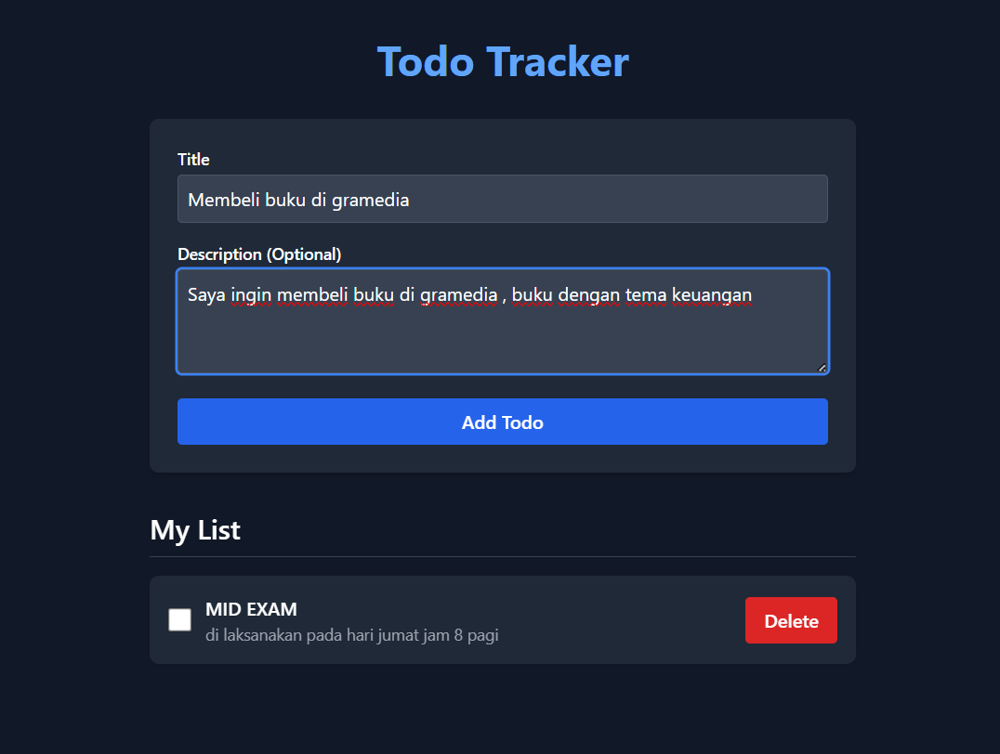

# 🚀 Todo Tracker App (Full Stack)

Aplikasi *full-stack* Todo Tracker ini dibangun menggunakan Node.js/Express (Backend) dan Next.js App Router (Frontend).

## 🛠️ Cara Menjalankan Proyek

Pastikan Anda memiliki Node.js (v20+) dan npm terinstal.

---

### 1. Backend Setup (API REST)

Backend menggunakan **SQLite** dan berjalan di **Port 3001**.

1.  **Instalasi & Database:**
    ```bash
    cd backend
    npm install
    # Perintah ini membuat file db.sqlite dan tabel Todos
    npx sequelize-cli db:migrate
    ```
2.  **Jalankan Server:**
    ```bash
    npm run dev
    # Server API berjalan di http://localhost:3001
    ```

---

### 2. Frontend Setup (Next.js)

Frontend berjalan di **Port 3000**.

1.  **Instalasi:**
    ```bash
    cd frontend
    npm install
    ```
2.  **Jalankan Aplikasi:** Kami menggunakan `--webpack` untuk memastikan stabilitas *build* pada Tailwind v4.
    ```bash
    npm run dev
    # Buka di browser: http://localhost:3000
    ```

## 📐 Keputusan Desain (Design Decisions)

### 1. Struktur Backend (Node.js/Express/Sequelize)

* **Clean Architecture:** Logika API diorganisir menggunakan pola **Controller-Route-Middleware** untuk pemisahan tugas (*Separation of Concerns*) dan keterbacaan kode yang jelas.
* **Data Layer:** Sequelize digunakan untuk manajemen model dan migrasi yang kokoh.
* **Error Handling:** Implementasi *middleware* error global untuk mengubah *error* Sequelize (misalnya, *validation error*) menjadi respons HTTP 400 atau 500 yang terstruktur.
* **Fix Konfigurasi:** File-file Sequelize (`models/index.cjs`, dll.) dinamai `.cjs` untuk mengatasi konflik antara sintaks ES Modules (yang digunakan server) dan CommonJS (yang digunakan Sequelize).

### 2. Struktur Frontend (Next.js App Router/Tailwind v4)

* **Pemisahan Komponen:** Digunakan *Client Components* (`page.js`, `AddTodoForm.js`) untuk semua interaksi (state management, fetch data) dan *Server Components* (`layout.js`) untuk struktur global.
* **Service Layer:** Semua interaksi HTTP dengan backend dikonsolidasikan dalam file `app/services/api.js`. Ini menjaga komponen UI tetap bersih dan fokus pada *rendering*.
* **Global Styling Fix:** *Styling* untuk `<body>` dipindahkan dari `@apply` di `globals.css` ke *class* `className` di `layout.js` untuk menghindari *circular dependency error* yang sering terjadi pada *build* Tailwind v4.
* **Styling:** Tailwind CSS v4 dipilih untuk implementasi *styling* yang cepat dan modern.

---

## 📈 Tampilan dan Fungsionalitas

Berikut adalah tampilan antarmuka aplikasi Todo Tracker:

### Daftar Tugas (Todo List)


### Menambahkan Tudo List


### Penghapusan Tugas


---

## 💡 Peningkatan yang Mungkin (Possible Improvements)

* **Testing Komprehensif:** Menerapkan *Unit Tests* (Jest/Supertest) untuk logika *Controller* backend dan *Integration Tests* (Testing Library) untuk *flow* frontend.
* **Autentikasi Pengguna:** Menambahkan fitur login/register dan mengaitkan setiap *Todo* dengan *User ID* tertentu.
* **Paginasi:** Mengimplementasikan fitur *Pagination* pada *endpoint* `GET /todos` untuk menangani ribuan data secara efisien.
* **Notifikasi:** Menambahkan notifikasi *toast* di frontend untuk umpan balik pengguna yang lebih baik (misalnya, "Todo Berhasil Dihapus!").
